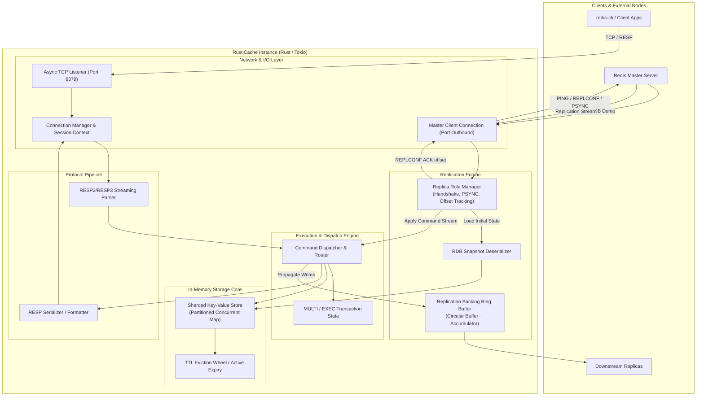
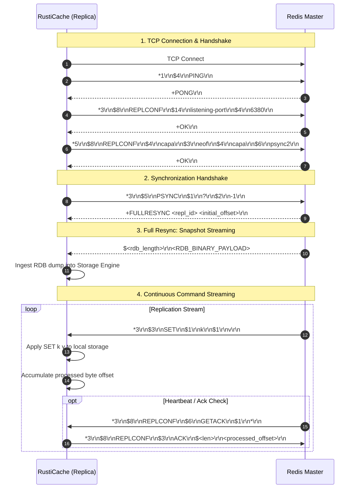

# RustiCache 🦀⚡

RustiCache is a high-performance, Redis-compatible in-memory datastore and replication engine implemented in Rust using the `tokio` asynchronous runtime.

This document details the architectural design, concurrency model, RESP protocol pipeline, and Redis master-replica replication subsystem.

---

## 1. High-Level Architecture

The system is decoupled into four primary layers:
1. **Network & Session Layer**: Asynchronous I/O processing powered by Tokio. Handles client TCP connections and upstream master connections.
2. **Protocol Engine (RESP2/RESP3)**: Zero-copy parser translating raw byte streams into typed commands and serializing responses.
3. **Storage & State Engine**: Sharded concurrent in-memory key-value store supporting TTL expiration, eviction policies, and atomic operations.
4. **Replication Subsystem**: Implements the Redis replication protocol (handshake, PSYNC, RDB ingestion, continuous replication stream, offset ACK tracking).



---

## 2. Replication Subsystem Architecture

RustiCache implements the Redis Replication Protocol to operate as a replica to an upstream master (or serve downstream replicas):

1. **Replication Handshake**:
   - `PING`: Verifies master liveness.
   - `REPLCONF listening-port <port>`: Informs the master of this node's port.
   - `REPLCONF capa eof capa psync2`: Advertises replication capabilities.
2. **Synchronization Negotiation (`PSYNC`)**:
   - Sends `PSYNC <repl_id> <offset>`.
   - If first sync: `PSYNC ? -1` triggers **Full Resync** (`+FULLRESYNC <repl_id> <offset>`).
   - If reconnecting: Attempts **Partial Resync** (`+CONTINUE <repl_id>`).
3. **RDB Snapshot Transfer & Ingestion**:
   - Parses incoming bulk payload containing the binary RDB snapshot and loads keys directly into the storage engine.
4. **Continuous Command Propagation**:
   - Master forwards all write commands in RESP format.
   - RustiCache executes them without returning client response packets.
   - Responds to `REPLCONF GETACK *` with `REPLCONF ACK <processed_bytes_offset>`.

### Replication Flow Sequence



---

## 3. Concurrency & Storage Engine Model

To achieve high throughput with minimal contention:

```mermaid
graph LR
    subgraph Concurrency["Request Handling & Storage Concurrency"]
        direction TB
        ClientReq["Incoming Client Streams\n(Tokio Tasks)"]
        ReplReq["Replication Stream Task"]
        
        subgraph Sharding["Sharded Partitions (e.g. 64 or 128 Shards)"]
            S0["Shard 0\nRwLock<HashMap<Key, ValueEntry>>"]
            S1["Shard 1\nRwLock<HashMap<Key, ValueEntry>>"]
            S2["Shard 2\nRwLock<HashMap<Key, ValueEntry>>"]
            Sn["Shard N...\nRwLock<HashMap<Key, ValueEntry>>"]
        end

        subgraph Expiry["Expiry Manager"]
            Wheel["Active Expiry Task\n(Sampling & Eviction)"]
        end
    end

    ClientReq -->|Hash(Key) % N| Sharding
    ReplReq -->|Hash(Key) % N| Sharding
    Wheel -.->|Periodic purge of expired keys| Sharding
```

### Storage Entry Structure
Each stored entry encapsulates:
- `value`: `DataType` enum (`String`, `List`, `Hash`, `Set`, `SortedSet`, `Stream`).
- `expires_at`: Optional timestamp (`Instant` / unix epoch ms) for TTL tracking.
- `version` / `last_accessed`: For LRU/LFU cache eviction policies.

---

## 4. Module Decomposition

```
RustiCache/
├── Cargo.toml
├── README.md
└── src/
    ├── main.rs                 # CLI arguments, config parsing & startup
    ├── server.rs               # Server loop and task supervision
    ├── connection.rs           # Framed TCP socket wrapper
    ├── protocol/
    │   ├── mod.rs
    │   ├── resp.rs             # RESP2 & RESP3 parser & types
    │   └── error.rs            # Protocol & decoding errors
    ├── commands/
    │   ├── mod.rs              # Command enum & router
    │   ├── strings.rs          # GET, SET, INCR, DECR, etc.
    │   ├── server.rs           # PING, ECHO, INFO, COMMAND
    │   └── replication.rs      # REPLCONF, PSYNC, WAIT
    ├── storage/
    │   ├── mod.rs
    │   ├── db.rs               # Database interface & shard manager
    │   ├── entry.rs            # Value types & metadata
    │   └── ttl.rs              # Passive & active expiry runner
    └── replication/
        ├── mod.rs
        ├── master.rs           # Logic when RustiCache runs as Master
        ├── replica.rs          # Client connecting to upstream Redis Master
        ├── handshake.rs        # Handshake sequence machine
        ├── rdb.rs              # RDB snapshot parser & loader
        └── backlog.rs          # In-memory circular buffer for partial resync
```

---

## 5. Technology Stack & Crates

- **Runtime**: [`tokio`](https://crates.io/crates/tokio) (Multi-threaded async executor)
- **Networking & Framing**: [`tokio-util`](https://crates.io/crates/tokio-util) (`codec` for RESP framing), [`bytes`](https://crates.io/crates/bytes) (Zero-copy byte buffers)
- **Concurrency**: [`parking_lot`](https://crates.io/crates/parking_lot) or [`dashmap`](https://crates.io/crates/dashmap)
- **CLI & Config**: [`clap`](https://crates.io/crates/clap)
- **Observability**: [`tracing`](https://crates.io/crates/tracing) & [`tracing-subscriber`](https://crates.io/crates/tracing-subscriber)
