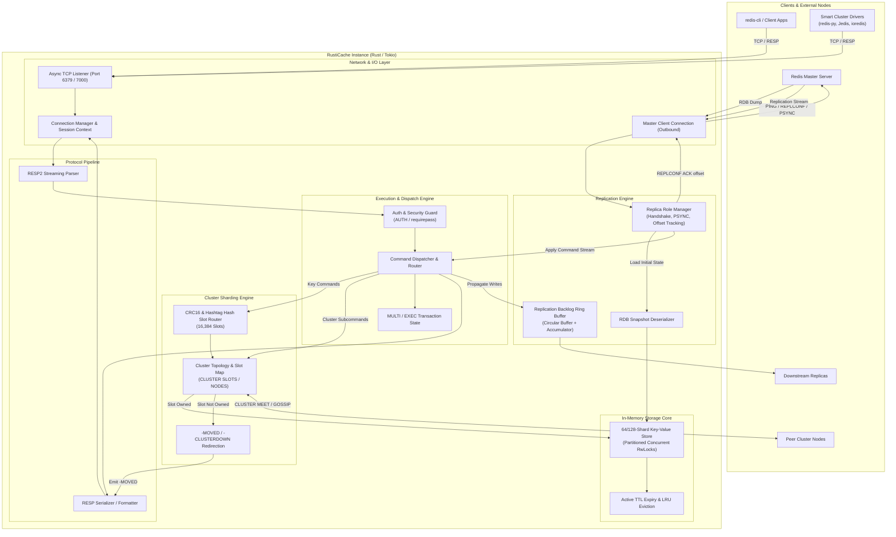
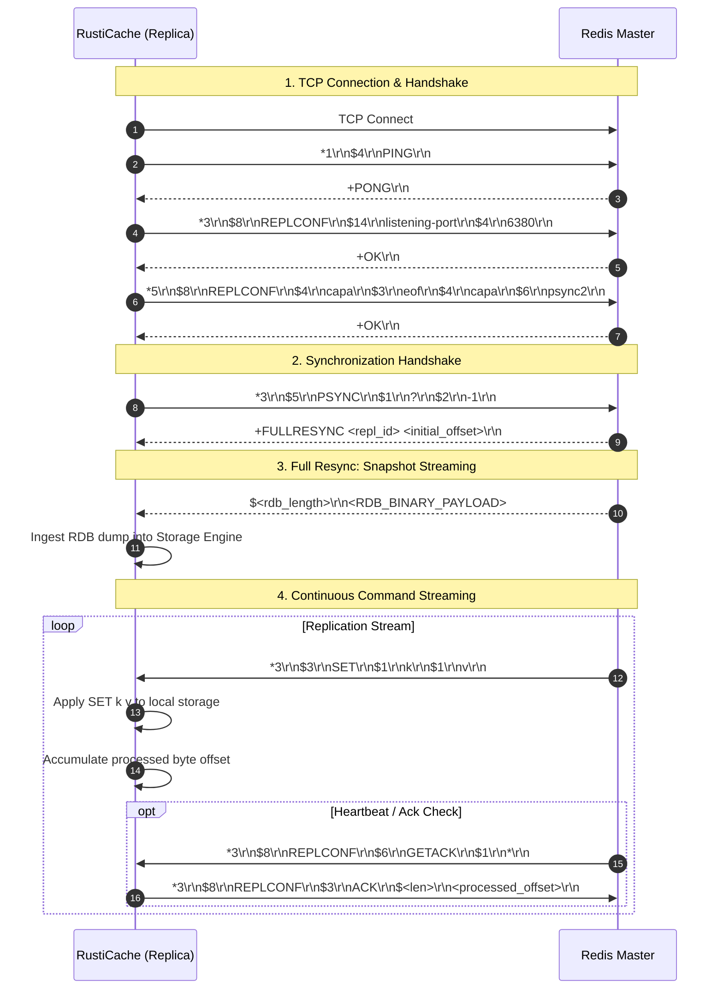
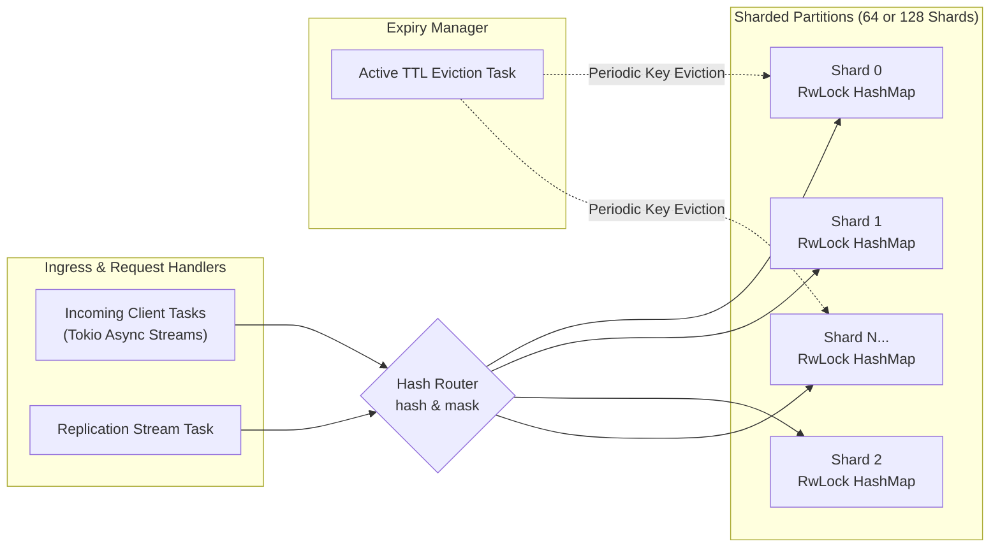
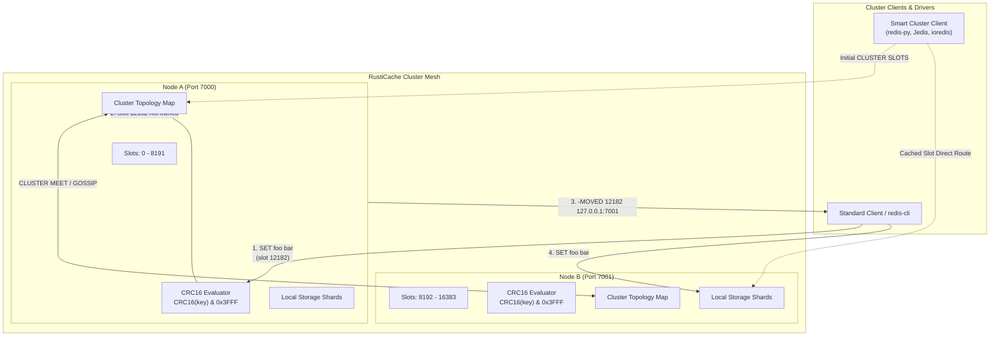

# RustiCache 🦀⚡

RustiCache is a high-performance, Redis-compatible in-memory datastore and replication engine implemented in Rust using the `tokio` asynchronous runtime.

This document details the architectural design, concurrency model, RESP protocol pipeline, and Redis master-replica replication subsystem.

---

## 1. High-Level Architecture

The system is decoupled into five primary subsystems:
1. **Network & Session Layer**: Asynchronous I/O processing powered by Tokio. Handles client TCP connections, downstream replica connections, and cluster peer interactions.
2. **Protocol Engine (RESP2)**: High-performance parser translating raw byte streams into typed Redis commands and serializing responses.
3. **Execution, Dispatch & Security**: Command routing, transaction management, and authentication guards (`requirepass` / `AUTH`).
4. **Cluster Sharding Engine**: CRC16 XMODEM hash slot routing across 16,384 slots, `{...}` hashtag parser, cluster topology discovery, and `-MOVED` client redirection.
5. **Storage Core & Eviction**: Sharded concurrent in-memory key-value store with power-of-two bitmask partitioning, passive TTL expiry, background active eviction, and LRU memory capacity enforcement.
6. **Replication Subsystem**: Master-replica replication protocol (handshake, `PSYNC`, RDB snapshot ingestion, continuous command stream propagation, and ACK tracking).



---

## 2. Replication Subsystem Architecture

RustiCache implements the Redis Replication Protocol to operate as a replica to an upstream master (or serve downstream replicas):

1. **Replication Handshake**:
   - `PING`: Verifies master liveness.
   - `REPLCONF listening-port <port>`: Informs the master of this node's port.
   - `REPLCONF capa eof capa psync2`: Advertises replication capabilities.
2. **Synchronization Negotiation (`PSYNC`)**:
   - Sends `PSYNC <repl_id> <offset>`.
   - If first sync: `PSYNC ? -1` triggers **Full Resync** (`+FULLRESYNC <repl_id> <offset>`).
   - If reconnecting: Attempts **Partial Resync** (`+CONTINUE <repl_id>`).
3. **RDB Snapshot Transfer & Ingestion**:
   - Parses incoming bulk payload containing the binary RDB snapshot and loads keys directly into the storage engine.
4. **Continuous Command Propagation**:
   - Master forwards all write commands in RESP format.
   - RustiCache executes them without returning client response packets.
   - Responds to `REPLCONF GETACK *` with `REPLCONF ACK <processed_bytes_offset>`.

### Replication Flow Sequence



---

## 3. Concurrency & Storage Engine Model

To achieve high throughput with minimal contention:



### Storage Entry Structure
Each stored entry encapsulates:
- `value`: `DataType` enum (`String`, `List`, `Hash`, `Set`, `SortedSet`, `Stream`).
- `expires_at`: Optional timestamp (`Instant` / unix epoch ms) for TTL tracking.
- `version` / `last_accessed`: For LRU/LFU cache eviction policies.

---

## 4. Redis Cluster Architecture & Hash Slot Sharding

RustiCache implements the Redis Cluster specification for horizontal scalability and data partitioning across multiple nodes.

### Sharding & Routing Model
- **16,384 Hash Slots**: Every key maps to a slot between `0` and `16383` via `CRC16(key) & 0x3FFF` using the XMODEM polynomial `0x1021`.
- **Hashtag Co-Location**: If a key contains `{...}` (e.g. `{user:42}:orders`), only the substring within the curly braces is hashed, guaranteeing that related keys reside on the same slot and physical node.
- **Smart Client Redirection**:
  - If a command arrives at a node owning the target slot, it is processed locally in memory.
  - If the slot is assigned to a peer node, RustiCache replies with `-MOVED <slot> <target_ip>:<target_port>\r\n`.
  - Smart cluster drivers (e.g. `redis-py`, `Jedis`, `ioredis`) cache slot-to-node assignments and route subsequent operations directly to the authoritative host.
  - If the slot is unassigned, `-CLUSTERDOWN Hash slot not served\r\n` is returned.

### Cluster Topology & Redirection Flow



---

## 5. Module Decomposition

```
RustiCache/
├── Cargo.toml
├── README.md
└── src/
    ├── main.rs                 # CLI arguments, config parsing & server bootstrap
    ├── server.rs               # Server loop, task supervision & cluster init
    ├── connection.rs           # Framed TCP socket wrapper & -MOVED redirection
    ├── config.rs               # Enterprise environment & CLI flag loader
    ├── protocol/
    │   ├── mod.rs
    │   ├── resp.rs             # Zero-copy RESP2 parser & serializer
    │   └── error.rs            # Protocol framing & decoding errors
    ├── commands/
    │   ├── mod.rs              # Command enum, router & cluster subcommands
    │   ├── strings.rs          # GET, SET, INCR, DECR, etc.
    │   ├── server.rs           # PING, ECHO, INFO, AUTH, COMMAND
    │   └── replication.rs      # REPLCONF, PSYNC, WAIT
    ├── cluster/
    │   ├── mod.rs              # ClusterManager type & lifecycle
    │   ├── slot.rs             # CRC16 checksum & hashtag extraction
    │   └── topology.rs         # Node state, slot tables, CLUSTER INFO/NODES/SLOTS
    ├── storage/
    │   ├── mod.rs
    │   ├── db.rs               # Database interface & shard manager
    │   ├── entry.rs            # Value types & metadata
    │   └── ttl.rs              # Passive & active expiry runner + LRU eviction
    └── replication/
        ├── mod.rs
        ├── master.rs           # Logic when RustiCache runs as Master
        ├── replica.rs          # Client connecting to upstream Redis Master
        ├── handshake.rs        # Handshake sequence machine
        ├── rdb.rs              # RDB snapshot parser & loader
        └── backlog.rs          # In-memory circular buffer for partial resync
```

---

## 6. Technology Stack & Crates

- **Runtime**: [`tokio`](https://crates.io/crates/tokio) (Configurable multi-threaded runtime with dedicated worker pools)
- **Networking & Framing**: [`tokio-util`](https://crates.io/crates/tokio-util) (`codec` for RESP framing), [`bytes`](https://crates.io/crates/bytes) (Zero-copy byte buffers)
- **Concurrency**: [`parking_lot`](https://crates.io/crates/parking_lot) with power-of-two bitmask sharded hash partitions
- **CLI & Config**: [`clap`](https://crates.io/crates/clap) with environment variable bindings
- **Observability**: [`tracing`](https://crates.io/crates/tracing) & [`tracing-subscriber`](https://crates.io/crates/tracing-subscriber)

---

## 7. Enterprise Standards & Features

1. **Security & Authentication**:
   - **`AUTH` & `requirepass`**: Supports password-protected client connections. Unauthenticated commands are blocked with `-NOAUTH Authentication required.`.
   - **`masterauth`**: Automatic upstream master authentication during replica handshake.
   - **Connection Limiting**: Bounded concurrent connections (`RUSTICACHE_MAX_CONNECTIONS`) via an atomic semaphore to prevent exhaustion attacks.
   - **Buffer & Payload Guards**: Maximum single frame size limit (`RUSTICACHE_MAX_PAYLOAD_SIZE_BYTES`) preventing memory exhaustion attacks.
   - **`TCP_NODELAY`**: Enabled by default to disable Nagle's algorithm and provide minimal socket latency.

2. **Concurrency & Multiprocessing**:
   - **Multi-Threaded Runtime**: Explicit worker pool control (`RUSTICACHE_WORKER_THREADS`, 0 for auto-core detection) via `tokio::runtime::Builder::new_multi_thread()`.
   - **Power-of-Two Bitmask Sharding**: Scalable storage partitioning (`RUSTICACHE_SHARD_COUNT`) utilizing fast bitwise masking `(hash & (N - 1))` instead of modulo arithmetic.

3. **Redis Cluster Horizontal Sharding**:
   - **16,384 Hash Slots**: Implements standard XMODEM `CRC16(key) % 16384` with `{...}` hashtag co-location.
   - **Smart Client Redirection**: Responds with `-MOVED <slot> <ip>:<port>` when a client queries a key outside this node's assigned slot range.
   - **Cluster Command Family**: Supports `CLUSTER KEYSLOT <key>`, `CLUSTER SLOTS`, `CLUSTER NODES`, `CLUSTER INFO`, `CLUSTER MEET <ip> <port>`, and `CLUSTER ADDSLOTS <slot...>`.
   - **Cluster Client Library Compatibility**: Compatible with `redis-py`, `Jedis`, `redis-rs`, and cluster-aware proxy routers.

4. **Memory Management & Eviction**:
   - **LRU Memory Capacity**: Configurable memory threshold (`RUSTICACHE_MAXMEMORY_BYTES`). When memory limit is reached, least recently used keys are evicted.
   - **Dual-Tier Expiry**: Passive/lazy cleanup on `GET` plus background active eviction sampling.

5. **Lifecycle & Reliability**:
   - **Graceful Shutdown**: Traps `SIGINT`/`Ctrl+C` and broadcasts coordinated termination to active client connections and background replication loops.

---

## 8. Configuration & Environment Variables

RustiCache supports configuration via both environment variables (or a local `.env` file) and CLI flags. CLI flags take precedence over `.env` values.

### Setting up `.env`:
```bash
cp .env.example .env
```

### Supported Configuration Options:

| Environment Variable | CLI Flag | Default | Description |
| :--- | :--- | :--- | :--- |
| `RUSTICACHE_PORT` | `-p, --port` | `6379` | Port to bind and listen on |
| `RUSTICACHE_HOST` | `--host` | `0.0.0.0` | Network interface / IP to bind to |
| `RUSTICACHE_REQUIREPASS` | `--requirepass` | *None* | Require clients to authenticate with `AUTH <password>` |
| `RUSTICACHE_MASTERAUTH` | `--masterauth` | *None* | Password for authenticating with master when running as replica |
| `RUSTICACHE_MAX_CONNECTIONS` | `--max-connections` | `10000` | Maximum concurrent client connections |
| `RUSTICACHE_MAX_PAYLOAD_SIZE_BYTES`| `--max-payload-size` | `536870912` (512MB) | Maximum payload size per request (anti-DoS guard) |
| `RUSTICACHE_TCP_NODELAY` | `--tcp-nodelay` | `true` | Enable TCP_NODELAY socket optimization |
| `RUSTICACHE_WORKER_THREADS` | `--worker-threads` | `0` (auto) | Tokio multi-thread worker count (0 = auto-detect CPU cores) |
| `RUSTICACHE_SHARD_COUNT` | `--shard-count` | `128` | Number of concurrent storage shards (power of 2) |
| `RUSTICACHE_MAXMEMORY_BYTES` | `--max-memory-bytes` | `0` (unlimited) | Max memory in bytes before LRU eviction triggers |
| `RUSTICACHE_TTL_INTERVAL_MS` | `--ttl-interval-ms` | `100` | Background active TTL eviction frequency in ms |
| `RUSTICACHE_TTL_SAMPLE_SIZE` | `--ttl-sample-size` | `20` | Number of keys sampled per shard during active eviction |
| `RUSTICACHE_REPLICAOF` | `--replicaof <host> <port>` | *None* | Set to `"<master_host> <master_port>"` to start in replica mode |
| `RUSTICACHE_CLUSTER_ENABLED` | `--cluster-enabled` | `false` | Enable Redis Cluster mode |
| `RUSTICACHE_CLUSTER_SLOTS` | `--cluster-slots <slots>` | `0-16383` | Hash slots owned by this node (e.g. "0-8191") |
| `RUSTICACHE_CLUSTER_NODE_ID` | `--cluster-node-id <id>` | *Auto* | 40-character hexadecimal cluster node ID |
| `RUSTICACHE_CLUSTER_ANNOUNCE_IP` | `--cluster-announce-ip` | `127.0.0.1` | Announced IP for client cluster redirection |
| `RUSTICACHE_CLUSTER_ANNOUNCE_PORT` | `--cluster-announce-port` | Match port | Announced client port for cluster redirection |
| `RUST_LOG` | *N/A* | `info` | Logging verbosity (`error`, `warn`, `info`, `debug`, `trace`) |

---

## 9. Running RustiCache

### Standalone / Master Mode:
```bash
# Using .env defaults (port 6379)
cargo run

# Or specifying port and password via CLI flags
cargo run -- --port 6379 --requirepass "mypassword"
```

### Replica Mode:
```bash
# Via CLI flag (syncing from master on port 6379 with authentication):
cargo run -- --port 6380 --replicaof 127.0.0.1 6379 --masterauth "mypassword"

# Or via .env:
# RUSTICACHE_PORT=6380
# RUSTICACHE_REPLICAOF="127.0.0.1 6379"
# RUSTICACHE_MASTERAUTH="mypassword"
cargo run
```

### Redis Cluster Mode:
```bash
# Start Node A owning slots 0-8191 (port 7000):
cargo run -- --port 7000 --cluster-enabled --cluster-slots 0-8191

# Start Node B owning slots 8192-16383 (port 7001):
cargo run -- --port 7001 --cluster-enabled --cluster-slots 8192-16383

# Introduce Node B to Node A using redis-cli:
redis-cli -p 7000 CLUSTER MEET 127.0.0.1 7001

# Check cluster state and slots:
redis-cli -p 7000 CLUSTER SLOTS
redis-cli -p 7000 CLUSTER INFO
```

### Running Tests:
```bash
cargo test
```


